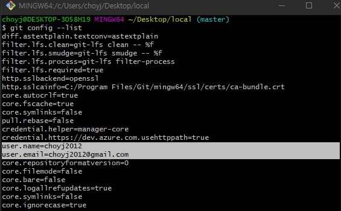
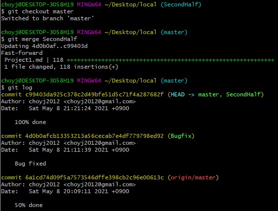

# README

## [GitHub Repository](https://github.com/choyj2012/GFM_Test2)

## 1. git 사용자 설정 (config)

> `config` 명령어를 통해 git의 다양한 설정을 할 수 있다.  
그 중에서 필수인 사용자의 이름과 이메일을 등록하자.

1. git bash 실행

2.  ```
    git config --global user.name "이름"
    git config --global user.email "이메일"
    ```
    `--global` : 설정한 값이 모든 곳에 적용된다.  
    `--local` : 현재 작업중인 프로젝트에만 적용

3. `git config --list`로 설정된 정보를 확인할 수 있다.

## 2. 로컬 저장소로 사용할 폴더 초기화 (init)

> 먼저 로컬 저장소로 사용할 폴더를 만들어 git 저장소로 설정해주자.

1. local 폴더 생성
2. git bash 실행
3. `git init` 명령어 실행
4. .git 파일이 생성된 것을 확인


## 3. 파일을 추가하고 커밋하기 (status, add, commit)

> git의 저장소는 작업폴더, 인덱스, 저장소 3가지로 이루어져 있다.  

> 작업폴더에서 수정한 내용을 먼저 `add` 명령어를 통해 중간단계인 인덱스에 기록한 뒤에 기록된 목록만 `commit` 명령어를 통해 최종적으로 저장소에 반영한다.

> `status` 명령어를 통해 파일들이 어떤 상태에 있는지 확인할 수 있다.

1. README.md 파일 생성
2. `git status`로 확인

아직 untrack 상태인 것을 알 수 있다.
3. `git add README.md`로 인덱스에 기록
4. `git commit -m "Add README"`로 저장소에 커밋  
  
`commit -m "설명"`
    + 커밋한 내용에 대한 설명을 추가하는 옵션.  
설명이 없으면 변경사항이 무엇인지 파악하기 어렵기 때문에 꼭 설명을 달자.

5. 같은 방법으로 Project1.md 파일 생성 (과제1 작성파일)

## 4. 커밋 기록 확인하고 커밋 되돌리기 (log, reset)

> `log` 명령어로 지금까지의 커밋 히스토리를 확인할 수 있다.

> `reset --hard` 명령어로 원하는 커밋의 시점으로 되돌릴 수 있다.

1. 커밋A, B 두개를 커밋하고 log를 확인해본다.  


2. 커밋A, B를 하기 전으로 돌아가고 싶다.  
`git reset --hard HEAD~2`  
`HEAD~2` : 현재시점에서 2단계 과거

3. `reset --hard` 실행후 `log` 확인  
  
두 단계가 사라진 것을 확인할 수 있다.

reset 옵션
- `--soft` : 돌아간 시점 이후의 커밋을 스테이징 상태로 변경  
- `--mixed` : 돌아간 시점 이후의 변경사항을 언스테이징 상태로 변경  
- `--hard` : 돌아간 시점 이후의 변경사항을 실제로 삭제(주의해서 사용해야한다)

## 5. GitHub 원격 저장소 생성 및 로컬 저장소와 연결 (remote)

> 다른 사람과 협업을 위해서는 원격 저장소가 필요하다.  
지금까지 작업했던 로컬 저장소를 GitHub 원격 저장소와 연결하자.

1. Github에 빈 Repository를 생성한다.

2. 기존 로컬 저장소에서 원격 저장소를 추가한다.  
`git remote add 이름 url`

3. `git remote -v` 를 통해 현재 연결되어있는 원격 저장소를 확인할 수 있다.  
  
origin이라는 이름을 가진 원격 저장소가 생성되고 연결된 것을 확인할 수 있다.


원격 저장소에 로컬 저장소에서 작업했던 내용이 생긴것을 확인할 수 있다.
## 6. 원격 저장소에 커밋 저장하기 (push)

> 로컬에만 저장되어있던 커밋을 원격 저장소에 업로드하자.

1. `git push <원격 저장소 이름> <브랜치 이름>` 으로 로컬 저장소의 커밋을 원격 저장소에 업로드 한다.
  
기본 브랜치이름은 master이다.

## 7. 원격 저장소 복제하기 (clone)

> 클라이언트 상에 아무것도 없을 때 원격 저장소의 프로젝트를 내려받는 명령어이다.

1. local2라는 폴더에서 다른 사람이 작업을 하기 위해 원격 저장소에서 프로젝트를 내려받는다.

2. `git clone [url]` 으로 프로젝트를 내려받는다.


## 8. 원격 저장소 받아오기 (pull)

> 다른 사람이 작업을 한 후 원격 저장소에 업로드한 내용을 내 로컬 저장소에도 받아와야 한다.

1. local2에서 Project1의 50%를 작성해서 원격 저장소에 push했다.
2. local1은 원격 저장소에 push된 내용을 `git pull` 로 받아오고 이어서 작업한다.

원격 저장소에서 받아온 내용이 로컬 저장소에 반영된 것을 확인할 수 있다.

## 9. 브랜치 생성하고 병합하기 (branch, checkout, merge, rebase)

> 여러 개발자들이 동일한 소스코드를 기반으로 서로 다른 작업을 할 때에 각각 서로 다른 버전의 코드가 만들어진다.  
이를 branch로 만들어서 관리할 수 있다.

1. Project1의 나머지 50%를 작성하기 위한 SecondHalf 브랜치 추가

2. Project1의 이미 작성되있던 앞부분에서 오류를 찾아서 이를 수정하기 위한 Bugfix 브랜치 추가
  
브랜치가 추가된 것을 확인할 수 있음.  
`git branch 이름` : 새로운 브랜치 생성  
`git branch -v` : 현재 등록된 브랜치를 확인할 수 있다.

3. Bugfix 브랜치에서 버그를 수정 완료해서 커밋.  
  
`git checkout 이름` : 해당 브랜치로 이동  
`git checkout -b 이름` : 브랜치 생성과 동시에 이동

4. master 브랜치와 Bugfix 브랜치를 merge  
  
`log` 를 통해 master 브랜치와 Bugfix 브랜치가 병합된 것을 확인할 수 있다.

5. SecondHalf 브랜치에서 나머지 50%을 작성완료하고 커밋.  
  

+ 5.1. merge된 브랜치와 아직 merge되지 않은 브랜치 확인   
`git branch --no-merge` : 아직 merge되지 않은 브랜치 목록  
`git branch --merge` : merge된 브랜치 목록  
 

6. Secondhalf 브랜치의 변경사항을 master 브랜치에 rebase  
  
  
`rebase` 후에 `log`를 확인하면 SecondHalf의 변경사항이 master 브랜치에서 커밋된 것처럼 변경된 것을 확인할 수 있다.

7. master 브랜치를 SecondHalf 브랜치로 merge  
  
`log`를 확인하면 master 브랜치가 옮겨진 것을 확인할 수 있다.

8. merge 완료된 브랜치는 삭제한다.  
  
`git branch --merge` 로 모두 merge 된 것을 확인할 수 있다.  
`git branch -d 이름` : 브랜치를 삭제한다.  
`log`를 확인하면 브랜치들이 삭제된 것을 확인할 수 있다.

## 9.1 merge와 rebase의 차이
- `merge` : 두 브랜치를 통합하는 것
- `rebase` : 브랜치의 base를 옮긴다는 것 >> 히스토리가 깔끔해진다.

## 10. 태그 달기 (tag)

> 태그는 주로 릴리즈 할 때 사용된다.

1. Project1이 완성되고 첫 버전 v1.0을 릴리즈하면서 태그를 설정한다.  
`-a 이름` : tag 이름 지정  
`-m "message"` : tag와 함께 저장할 메시지  
  
태그는 `git push`명령으로 자동으로 업로드 되지 않는다.  
`git push origin 태그이름`으로 `push`할 수 있다.


<!--
| Command   |  Use  | link |
| -------   | ------| ---  |
| add       |   O   |[go](#3.-파일을-추가하고-커밋하기-(status,-add,-commit)) |
| branch    |   O   |[go](#9.-브랜치-생성하고-병합하기-(branch,-checkout,-merge,-rebase))|
| checkout  |   O   |[go](#9.-브랜치-생성하고-병합하기-(branch,-checkout,-merge,-rebase))|
| clone     |  O    |[go](#7.-원격-저장소-복제하기-(clone))|
| commit    |  O    |[go](#3.-파일을-추가하고-커밋하기-(status,-add,-commit)) |
| config    |  O    |[go](#1.-git-사용자-설정-(config))|
| init      |  O    |[go](#2.-로컬-저장소로-사용할-폴더-초기화-(init))|
| log       |  O    |[go](#4.-커밋-기록-확인하고-커밋-되돌리기-(log,-reset))|
| merge     |  O    |[go](#9.-브랜치-생성하고-병합하기-(branch,-checkout,-merge,-rebase))|
| pull      |  O    |[go](#8.-원격-저장소-받아오기-(pull))|
| push      |  O    |[go](#6.-원격-저장소에-커밋-저장하기-(push))|
| rebase    |  O    |[go](#9.-브랜치-생성하고-병합하기-(branch,-checkout,-merge,-rebase))|
| remote    |  O    |[go](#5.-GitHub-원격-저장소-생성-및-로컬-저장소와-연결-(remote))|
| reset --hard|  O  |[go](#4.-커밋-기록-확인하고-커밋-되돌리기-(log,-reset))|
| status    |  O    |[go](#3.-파일을-추가하고-커밋하기-(status,-add,-commit)) |
| tag       |  O    |[go](#10.-태그-달기-(tag))
-->
| Command   |  Use  | link |
| -------   | ------| ---  |
| add       |   O   |[go](#3-파일을-추가하고-커밋하기-status-add-commit) |
| branch    |   O   |[go](#9-브랜치-생성하고-병합하기-branch-checkout-merge-rebase)|
| checkout  |   O   |[go](#9-브랜치-생성하고-병합하기-branch-checkout-merge-rebase)|
| clone     |  O    |[go](#7-원격-저장소-복제하기-clone)|
| commit    |  O    |[go](#3-파일을-추가하고-커밋하기-status-add-commit) |
| config    |  O    |[go](#1-git-사용자-설정-config)|
| init      |  O    |[go](#2-로컬-저장소로-사용할-폴더-초기화-init)|
| log       |  O    |[go](#4-커밋-기록-확인하고-커밋-되돌리기-log-reset)|
| merge     |  O    |[go](#9-브랜치-생성하고-병합하기-branch-checkout-merge-rebase)|
| pull      |  O    |[go](#8-원격-저장소-받아오기-pull)|
| push      |  O    |[go](#6-원격-저장소에-커밋-저장하기-push)|
| rebase    |  O    |[go](#9-브랜치-생성하고-병합하기-branch-checkout-merge-rebase)|
| remote    |  O    |[go](#5-github-원격-저장소-생성-및-로컬-저장소와-연결-remote)|
| reset --hard|  O  |[go](#4-커밋-기록-확인하고-커밋-되돌리기-log-reset)|
| status    |  O    |[go](#3.-파일을-추가하고-커밋하기-(status,-add,-commit)) |
| tag       |  O    |[go](#10-태그-달기-tag)